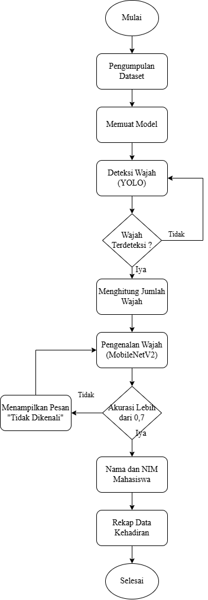

# A-Robust-Approach-to-Student-Attendance-Using-Web-Based-Facial-Recognition

## Explanation of MobileNetV2 for Face Recognition and YOLO for Face Detection

  MobileNetV2 is a deep learning architecture designed for applications on resource-constrained devices, such as mobile phones or IoT devices. Known for its efficiency, MobileNetV2 uses inverted residuals and linear bottlenecks to minimize the number of parameters and computational operations required during inference without sacrificing much accuracy. This makes it an excellent choice for face recognition tasks, where computational resources may be limited.
In face recognition, MobileNetV2 serves as a backbone model for feature extraction from face images. These features, often represented as embeddings, are used for comparing with previously enrolled face data stored in a database. Matching algorithms like Cosine Similarity or Euclidean Distance can then determine the identity of the person

  YOLO (You Only Look Once) is a CNN-based object detection model designed to detect objects in images or video with high speed and accuracy. YOLOv8, the latest version, brings improvements in both detection precision and performance speed. YOLO employs a single-shot detection approach, meaning the entire image is processed in one pass, enabling rapid detection.
For face detection, YOLOv8 can be fine-tuned to identify faces in images or videos quickly. It detects bounding boxes around faces, providing precise localization. YOLOv8 excels in speed, making it suitable for real-time applications, and is robust against complex backgrounds or varying lighting conditions.

By integrating YOLO for face detection and MobileNetV2 for face recognition, you can develop an efficient and scalable face recognition system. YOLOv8 can quickly detect faces in images or video streams, providing bounding boxes for each detected face. These regions are then passed to MobileNetV2, which extracts features and compares them with a database to identify the individuals. This combination ensures both speed and accuracy, making it ideal for real-time applications like attendance tracking or security systems.

---

## Flowchart



---

## Installation

### Step 1: Clone the Repository
```bash
git clone <repository-url>
cd <repository-folder>
